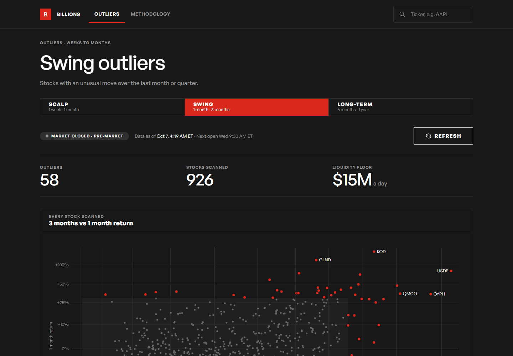
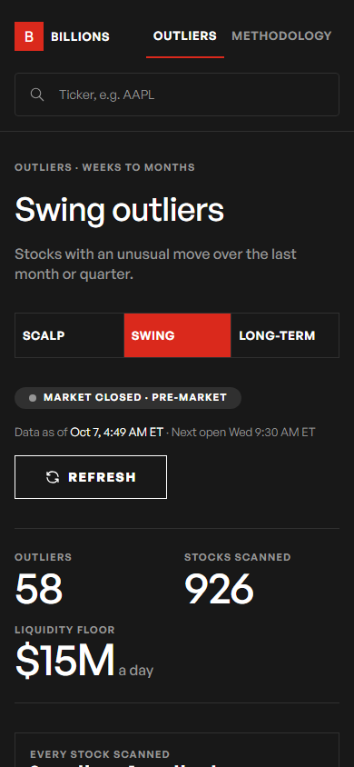
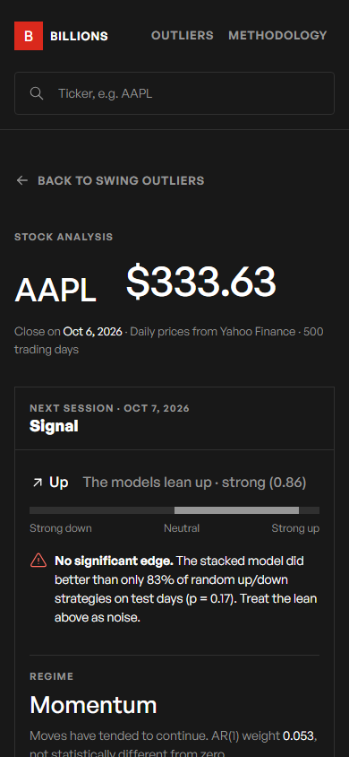

# BILLIONS

BILLIONS finds US stocks that are moving unusually far from the rest of the market. For each one, it shows a tested quant analysis: signal, edge, risk, and whether any of it beats chance.

It is a read-only web app. **Information only. Not financial advice. This tool does not place trades.**



| Outliers (phone) | Stock analysis (phone) |
|---|---|
|  |  |

Full analysis page: [docs/screenshots/analysis-desktop-full.png](docs/screenshots/analysis-desktop-full.png)

## Pages

| URL | What it shows |
|---|---|
| `/` | Home page: a hero, the live board (top five swing outliers and scan stats), the three strategies, and a ticker lookup |
| `/outliers/scalp`, `/outliers/swing`, `/outliers/longterm` | Every liquid NASDAQ stock on a scatter of two return windows, plus a ranked list of the ones more than 2 standard deviations from the group |
| `/analysis/{TICKER}` | Signal, price and next-session forecast, out-of-sample edge, risk, model comparison, validation, cost check, and the limits of all of it |
| `/methodology` | How every number is made, in plain words |

The header on every page has a ticker search, so you can open any NASDAQ stock's analysis from anywhere.

Each page has its own URL, title and link preview, and works with the browser's back and forward buttons. The app can be installed to a phone's home screen (web app manifest and icons), and it shows an offline page without a connection.

## How it works

**Outliers.** The scan starts from about 4,000 NASDAQ common stocks (the free NASDAQ Trader symbol list). It keeps the 1,000 most traded by median dollar volume, then computes two trailing returns per strategy. A stock is an outlier when either return is more than 2 standard deviations from the group. The scan runs in the background: at startup, every 30 minutes while the market is open, and once after each close. The page checks for new data every 5 minutes.

**Analysis** follows the quant handbook in `docs/reference/`, using two years of daily closes:

- Log returns and lagged, sign, rolling-mean and weekday features. Every rolling window is shifted by one day, and a unit test proves that no feature uses data from the day it forecasts.
- Four models: AR(1), XGBoost (depth 3), an online Passive-Aggressive learner, and a stacked blend with non-negative weights.
- Validation: a 75/25 time-ordered split, expanding and rolling walk-forward, and a comparison with 1,000 random up/down strategies.
- Headline numbers are out-of-sample. In-sample numbers are labeled as such.
- Output is information only: direction, a bounded strength score, risk numbers and plain caveats. It never gives sizes, orders or buy/sell instructions.

Details: [`/methodology`](web/app/methodology/page.tsx) and [`docs/REFACTOR_PLAN.md`](docs/REFACTOR_PLAN.md).

## Data source and its limits

- Prices come from **Yahoo Finance** through `yfinance`, an unofficial library. Data can be delayed, missing or wrong, and there is no service guarantee.
- **No order book (level 2).** Order-book imbalance and mid-price are shown as "Not available with current data source". They are never estimated.
- **Daily bars only.** The forecast horizon is one trading day.
- Stocks with less than about a year of history get price and risk only, with a note that the models need more data.

## Run it locally

You need Node 20+, pnpm 9+ and Python 3.12+.

```bash
pnpm install     # root dev tools
pnpm setup       # web dependencies + Python venv in .venv
pnpm dev         # API on http://localhost:8000, web on http://localhost:3000
```

Or, with Docker: `docker compose up`.

The first outlier scan takes about 2 minutes after the API starts. Until then, the page says there is no data yet.

## Environment variables

Backend (`.env` in the repo root; see [`.env.example`](.env.example)):

| Name | Default | Purpose |
|---|---|---|
| `CORS_ORIGINS` | `http://localhost:3000,http://127.0.0.1:3000` | Allowed frontend origins, comma-separated |
| `DATABASE_URL` | `sqlite:///./data/billions.db` | Outlier cache. A PostgreSQL URL also works. |
| `OUTLIER_SCHEDULER` | `true` | Run the background outlier scan |
| `REFRESH_INTERVAL_MINUTES` | `30` | Scan interval while the market is open |
| `RATE_LIMIT_DEFAULT` / `RATE_LIMIT_ANALYSIS` | `120/minute` / `20/minute` | Per-IP limits |
| `ALPHA_VANTAGE_API_KEY` | empty | Optional second source for the symbol list |

Frontend (`web/.env.local`; see [`web/.env.example`](web/.env.example)):

| Name | Purpose |
|---|---|
| `NEXT_PUBLIC_API_URL` | Backend URL as the browser sees it |
| `API_URL` | Optional backend URL for the Next.js server (defaults to the above) |
| `NEXT_PUBLIC_SITE_URL` | Public site URL, for canonical links and link previews |

## Tests and checks

```bash
pnpm test                        # pytest (70 tests) + vitest (15 tests)
pnpm lint                        # flake8 + eslint
pnpm --dir web typecheck
pnpm --dir web test:e2e          # Playwright: outliers -> analysis, desktop and phone, against a mock API
```

CI (`.github/workflows/ci.yml`) runs backend lint and tests, then frontend lint, types, tests and build, then the E2E suite.

Lighthouse on the production build scores 95+ on mobile and 100 on desktop for Performance, Accessibility, Best Practices and SEO. See [`docs/lighthouse/README.md`](docs/lighthouse/README.md).

## Deploy

**Backend: Railway or Render.** Both build [`api/Dockerfile`](api/Dockerfile) (about 860 MB image, about 170 MB of memory at rest).

- *Railway:* create a project from this repo. `railway.json` selects the Dockerfile and the `/health` check. Set `CORS_ORIGINS` to your Vercel URL.
- *Render:* create a Blueprint from [`render.yaml`](render.yaml), then set `CORS_ORIGINS`.
- The SQLite cache lives on the container's disk. It is rebuilt by the first scan after each deploy.

**Frontend: Vercel.** Import the repo, set **Root Directory** to `web`, and set `NEXT_PUBLIC_API_URL` (the backend URL) and `NEXT_PUBLIC_SITE_URL` (the Vercel URL). [`web/vercel.json`](web/vercel.json) pins the install and build commands.

## Project structure

```
api/                 FastAPI backend
  routers/           outliers.py, analysis.py
  services/          outlier_engine.py, outliers.py (scheduler + read model), quant_analysis.py,
                     analysis.py (cache), prices.py, universe.py, market_calendar.py
  tests/             pytest suite
web/                 Next.js app (App Router, TypeScript, Tailwind v4)
  DESIGN.md          design system (Ferrari-based), showroom layer and copy rules
  app/               home page, outliers/[strategy], analysis/[ticker], methodology, offline
  components/        charts (hand-written SVG), analysis, home (hero art), ui, logo
  e2e/               Playwright tests, mock API and recorded fixtures
docs/                refactor plan, reference PDFs, screenshots, Lighthouse results
scripts/             one-command dev helpers
```

## Licence

MIT. See [`LICENSE`](LICENSE). General Sans is used under the ITF Free Font License. It is downloaded from Fontshare at build time and not stored in this repository.
